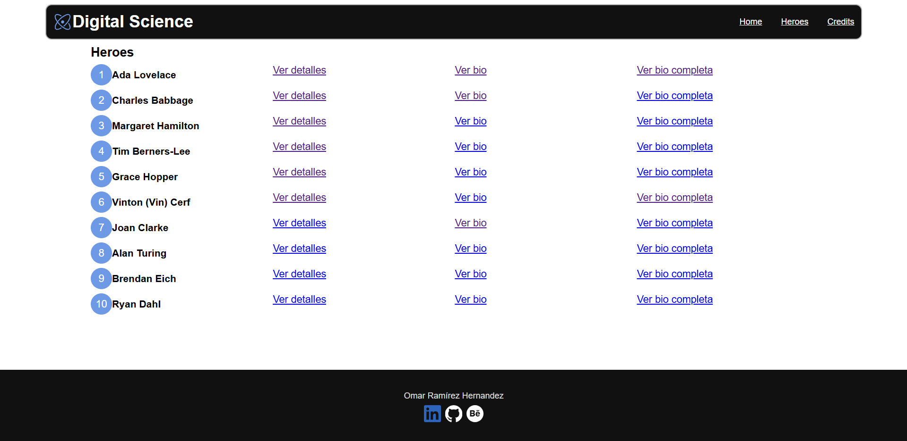
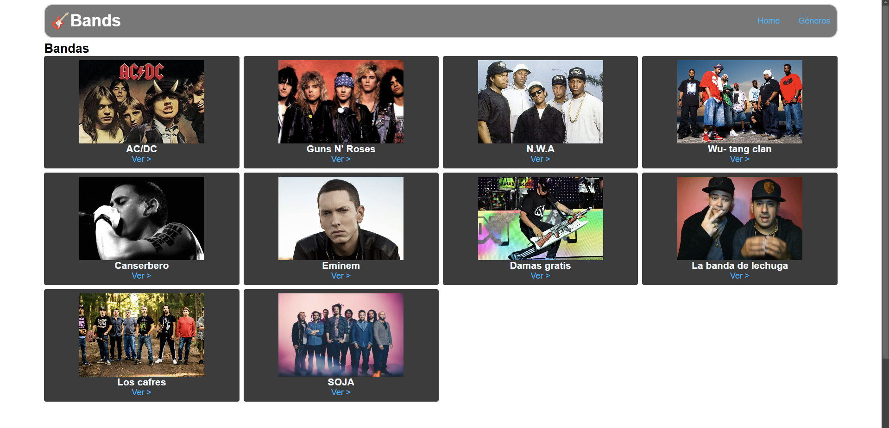

# Express Digital House
Este repositorio contiene una colección de proyectos realizados para la certificación "Programación web Full Stack" de DigitalHouse.

## Características
- Express
- Node.js
- Patrón MVC
- Uso de plantillas

# Lista de proyectos
## 1. Digital Science
Una pequeña web que alberga información de 10 de los científicos más relevantes en lo que programación respecta.
- URL params
- Endpoints
- Patrón MVC
- Express generator
- Ejs

## 2. Rock bands
Una pequeña web que alberga información de bandas de rock, la información se puede acceder por la banda o por el genero
- URL params
- Endpoints
- Patrón MVC
- Express generator
- Ejs
- Query params

